<!-- START doctoc generated TOC please keep comment here to allow auto update -->
<!-- DON'T EDIT THIS SECTION, INSTEAD RE-RUN doctoc TO UPDATE -->
# Table Of Content

- [Annoying OpenCV](#annoying-opencv)
  - [Prerequisite](#prerequisite)
    - [Environemnt Setting](#environemnt-setting)
    - [Primers Install](#primers-install)
      - [Install X-Code](#install-x-code)
      - [Install X-Code Command Line](#install-x-code-command-line)
      - [Install Homebrew](#install-homebrew)
      - [Install Apache Ant](#install-apache-ant)
      - [Install gst-plugin-base](#install-gst-plugin-base)
      - [Install CMake](#install-cmake)
      - [Install CMake GUI](#install-cmake-gui)
      - [Install FFmpeg](#install-ffmpeg)
    - [Download OpenCV](#download-opencv)
  - [Build](#build)
    - [Unzip OpenCV in `~/desktop/`](#unzip-opencv-in-desktop)
    - [Create a new empty folder `build`](#create-a-new-empty-folder-build)
    - [Configure paths in  `CMake GUI` then click `Configure`](#configure-paths-in--cmake-gui-then-click-configure)
    - [Configure attributes in `CMake GUI`](#configure-attributes-in-cmake-gui)
    - [Configure again and agian util:](#configure-again-and-agian-util)
    - [Click `Generate`](#click-generate)
    - [Finally, `make`](#finally-make)
  - [Configure IDE](#configure-ide)
  - [Test](#test)
- [Resources](#resources)
- [Reference](#reference)

<!-- END doctoc generated TOC please keep comment here to allow auto update -->

# Annoying OpenCV 
## Prerequisite
### Environemnt Setting
- MacOS Mojave 10.14.5
- JDK 8 `or` JDK 12
- [Intellij Ultimate](https://www.jetbrains.com/student/)

### Primers Install
#### Install X-Code
`App Store` > `X-code` > `Install`
#### Install X-Code Command Line
```sh
xcode-select --install
```
#### Install Homebrew
```sh
/usr/bin/ruby -e "$(curl -fsSL https://raw.githubusercontent.com/Homebrew/install/master/install)"
```
#### Install Apache Ant
```sh
# you may need to remove .DS_Store
brew install ant 
```
#### Install gst-plugin-base
```sh
brew install gst-plugins-base
```
#### Install CMake
```sh
brew install cmake
```
#### Install CMake GUI
[Download](https://github.com/Kitware/CMake/releases/download/v3.16.0-rc2/cmake-3.16.0-rc2-Darwin-x86_64.dmg) > `Double Click` > `Install`

#### Install FFmpeg
- [Download](https://www.ffmpeg.org/releases/ffmpeg-4.2.1.tar.gz)
- **Unzip** as `~/desktop/ffmpeg-4.2.1`
- **Compile**
```sh
cd ffmpeg-4.2.1
./configure
make -j4
make install
```

### Download OpenCV
- [OpenCV 3.4.7](https://github.com/opencv/opencv/archive/3.4.7.zip)
- [OpenCV Contrib 3.4.7](https://github.com/opencv/opencv_contrib/archive/3.4.7.zip)

## Build
### Unzip OpenCV in `~/desktop/`
<div style="text-align:center; margin:auto">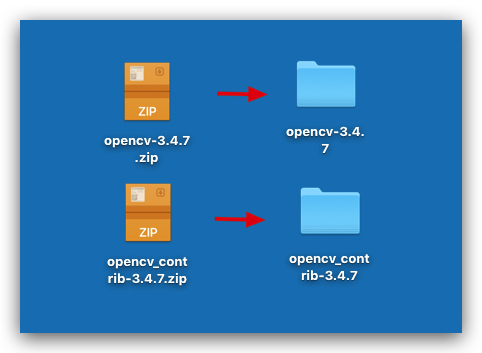</div>

### Create a new empty folder `build`
<div style="text-align:center; margin:auto">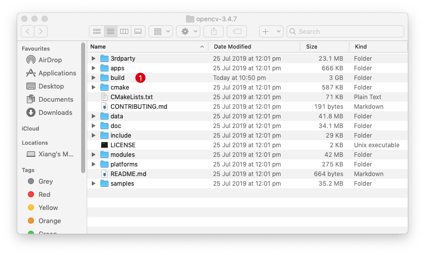</div>

### Configure paths in  `CMake GUI` then click `Configure`
<div style="text-align:center; margin:auto">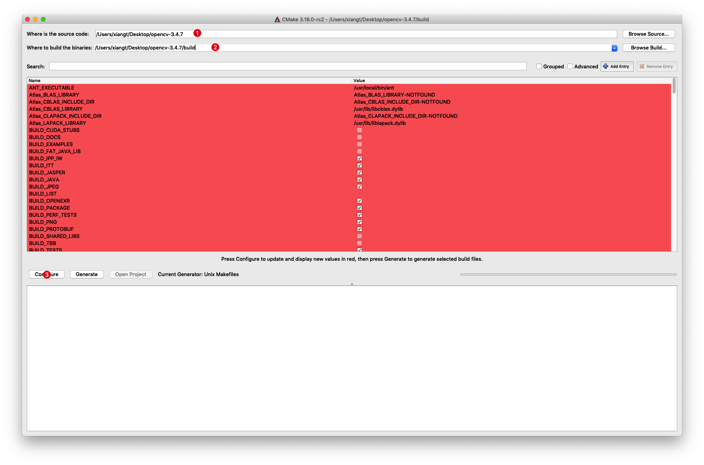</div>

### Configure attributes in `CMake GUI`
<div style="text-align:center; margin:auto">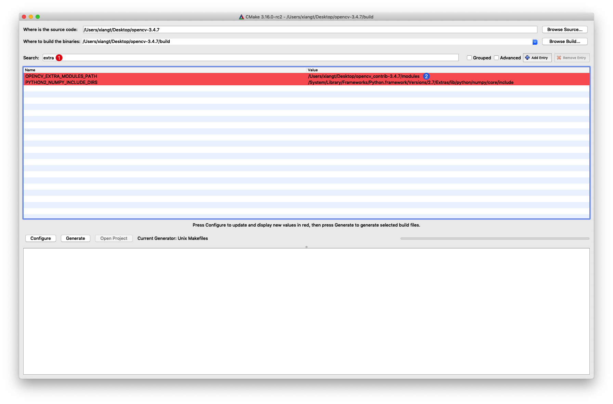</div>

<div style="text-align:center; margin:auto"></div>

<div style="text-align:center; margin:auto">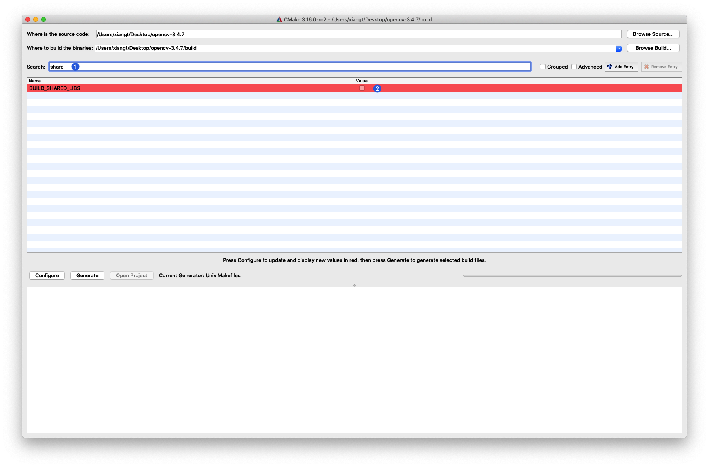</div>

<div style="text-align:center; margin:auto">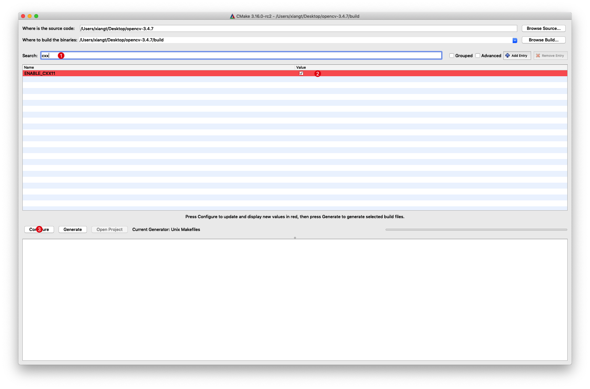</div>

### Configure again and agian util:
<div style="text-align:center; margin:auto">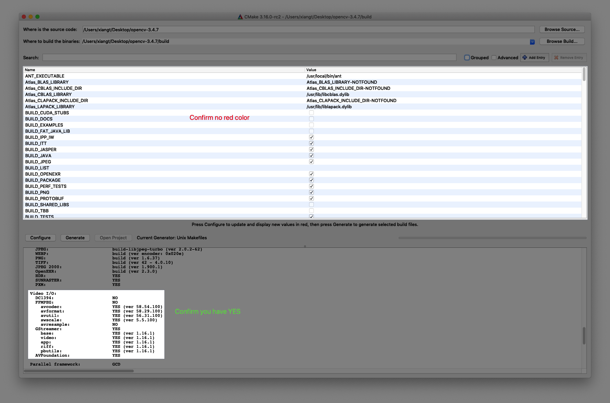</div>

### Click `Generate`
  <div style="text-align:center; margin:auto">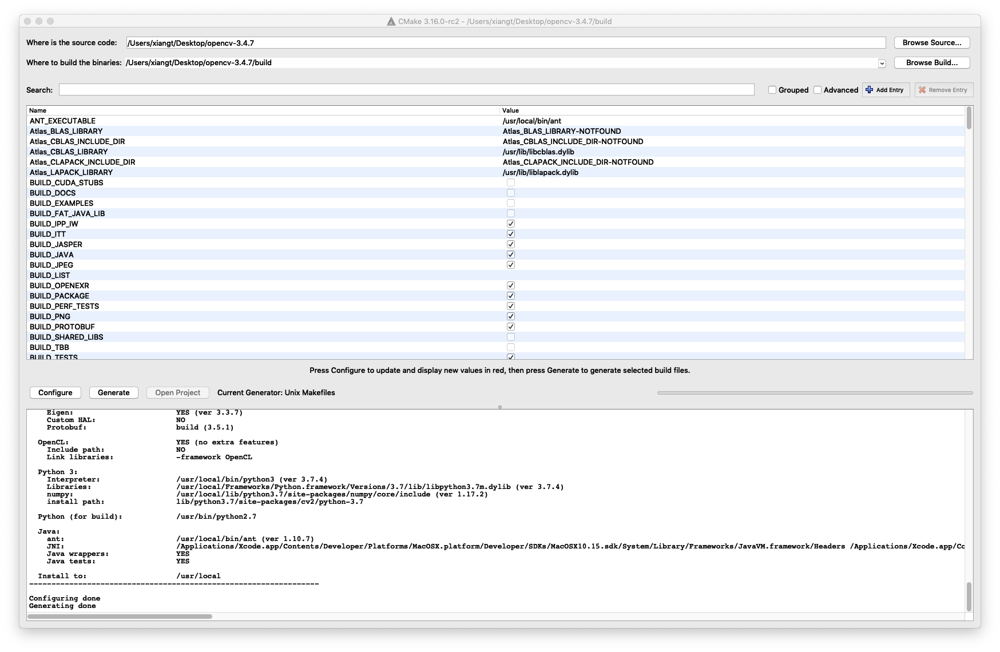</div>

### Finally, `make`
```sh
cd build
make -4j
```

## Configure IDE
- Create `JavaFX` Project
<div style="text-align:center; margin:auto"></div>

- Copy Built File into Project
  - Copy `‎⁨opencv-3.4.7/build/bin/pencv-347.jar` to Intelli Project folder `lib`
  - Copy `opencv-3.4.7/build/lib/libopencv_java347.dylib` to Intelli Project folder `lib`
<div style="text-align:center; margin:auto">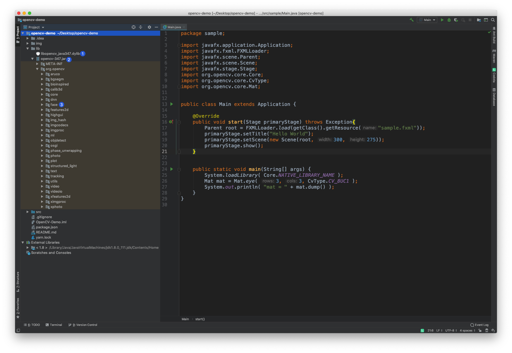</div>

- Config `File` > `Project Struture`
<div style="text-align:center; margin:auto">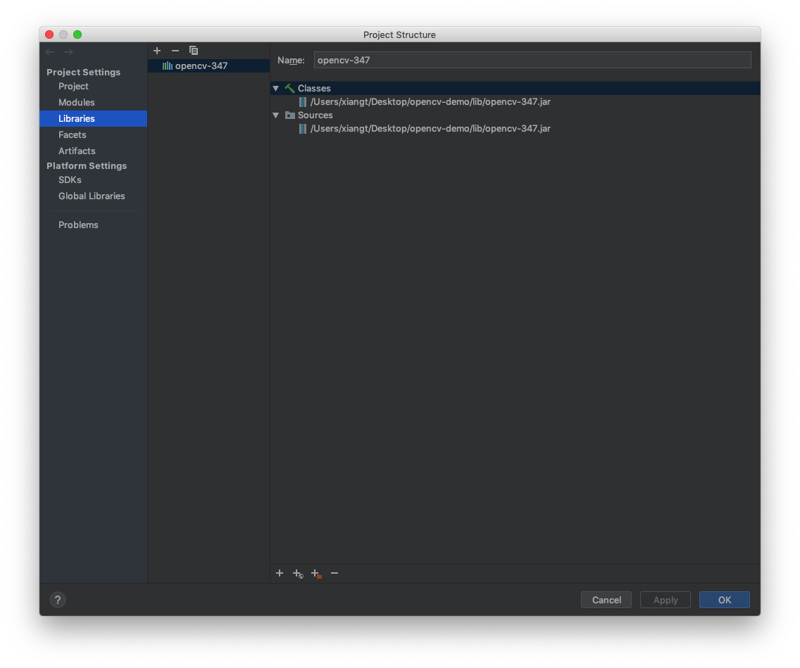</div>

- Config VM Options in `Run` > `Edit Configurations`
  - `-Djava.library.path=/opencv/build/lib`
<div style="text-align:center; margin:auto"></div>

## Test
<div style="text-align:center; margin:auto">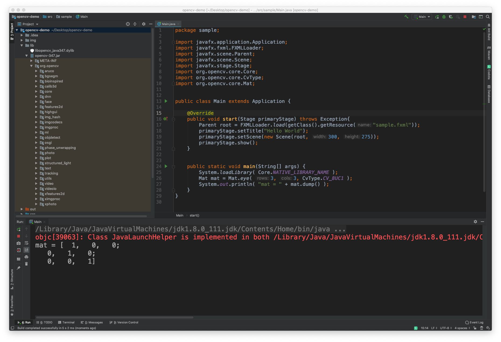</div>

# Resources
- [OpenCV 3.0 Computer Vision with Java]()
- [OCA Java SE I]()
- [OCP Java SE II]()

# Reference
- [OpenCV Java Tutorial](https://opencv-java-tutorials.readthedocs.io/en/latest/index.html)
- [OpenCV Java Tutorial Github](https://github.com/opencv-java/opencv-java-tutorials)
- [Install OpenCV 3.x under macOS](https://opencv-java-tutorials.readthedocs.io/en/latest/01-installing-opencv-for-java.html#install-opencv-3-x-under-macos)
- [Set up OpenCV for Java in other IDEs (experimental)](https://opencv-java-tutorials.readthedocs.io/en/latest/01-installing-opencv-for-java.html#set-up-opencv-for-java-in-other-ides-experimental)
- [Using OpenCV Java with Eclips](https://docs.opencv.org/2.4.11/doc/tutorials/introduction/java_eclipse/java_eclipse.html)
- [macOS 安装 opencv3.4](https://my.oschina.net/u/3767256/blog/1614886)
- [Java Dev Intro](https://docs.opencv.org/2.4/doc/tutorials/introduction/desktop_java/java_dev_intro.html)
- [PKG Uninstaller](https://www.corecode.io/uninstallpkg/)
