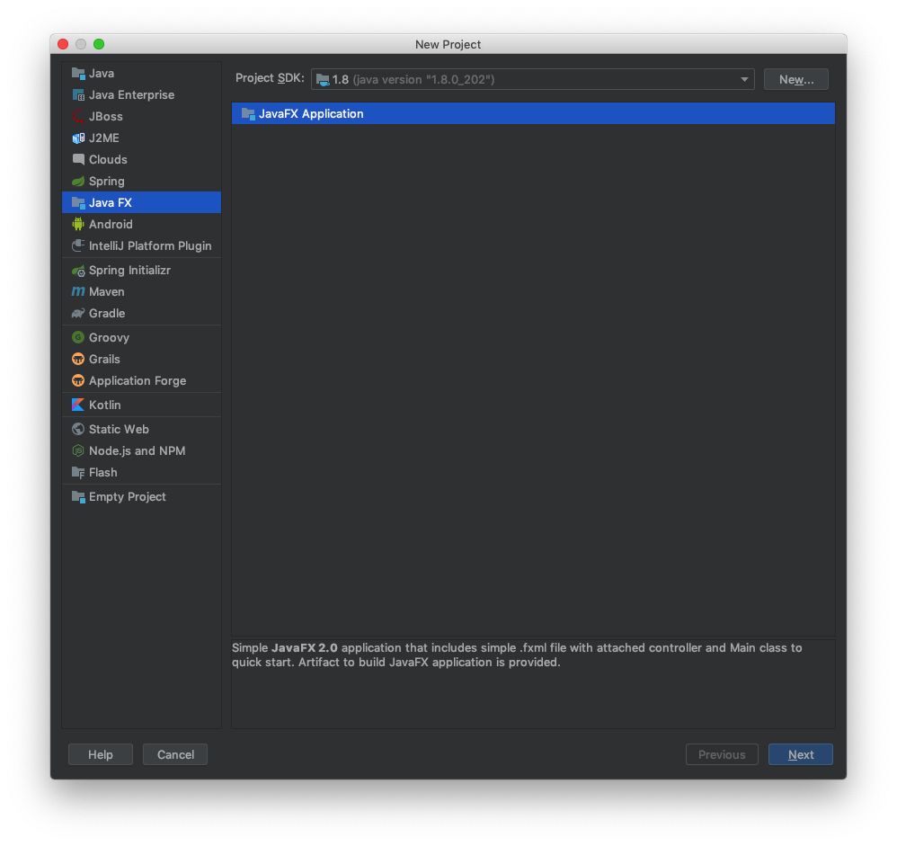
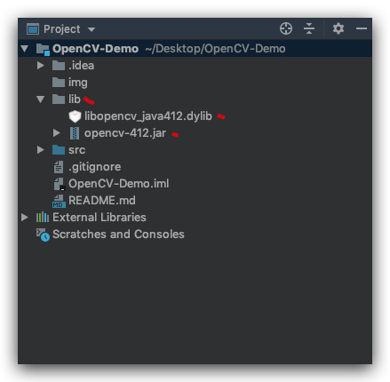
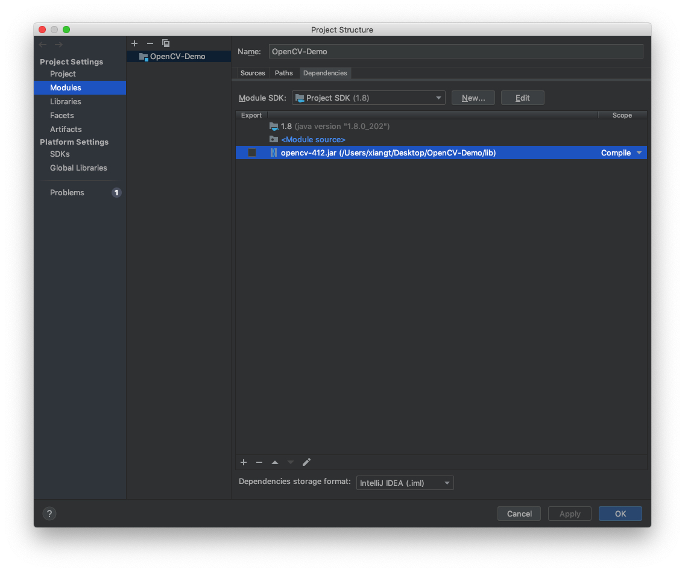
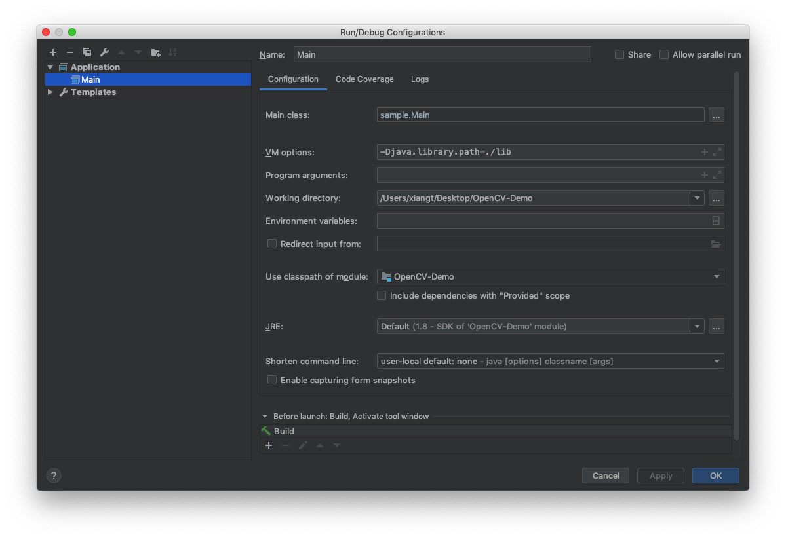
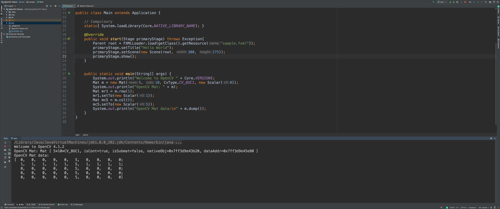

<!-- START doctoc generated TOC please keep comment here to allow auto update -->
<!-- DON'T EDIT THIS SECTION, INSTEAD RE-RUN doctoc TO UPDATE -->
## Table Of Content

- [Group Project Configuration Demo](#group-project-configuration-demo)
  - [Environment](#environment)
  - [Stage: Build OpenCV](#stage-build-opencv)
  - [Stage: Config Intellij](#stage-config-intellij)
  - [Stage Run](#stage-run)
- [Reference](#reference)

<!-- END doctoc generated TOC please keep comment here to allow auto update -->


## Group Project Configuration Demo
### Environment
- MacOS 10.14.5
- [Intellij](https://www.jetbrains.com/idea/)
- [Homebrew](https://brew.sh/)
- X-code CLI
- [OpenCV 4.1.2](https://opencv.org/releases/)

### Stage: Build OpenCV
- Install `X-code Command Line`
```sh
xcode-select --install
```
- Install Apache `Ant`
```sh
# you may need to remove .DS_Store
brew install ant 
```
- Config `HomeBrew`
```sh
export HOMEBREW_EDITOR=code # for vscode
export HOMEBREW_EDITOR=nano # for nano
export HOMEBREW_EDITOR=sublime # for sublime
export HOMEBREW_EDITOR=atom # for atom
export HOMEBREW_EDITOR="open -t" # for TextEdit
brew edit opencv
```
- Modify `opencv.rb`
<!-- https://github.com/opencv/opencv/archive/4.0.1.tar.gz -->
```ruby
# line 1
url "https://github.com/opencv/opencv/archive/4.1.2.tar.gz"
# line 2
-DBUILD_opencv_java=ON
```


- Install and build `opencv`
```sh
# patience from 20 - 40 minutes
brew install --build-from-source opencv
```

### Stage: Config Intellij
- Create `JavaFX` Project
<div style="text-align:center; margin:auto"></div>

- Copy Built File into Project
```sh
open /usr/local/Cellar/opencv/4.1.2/share/java/opencv4
```
<div style="text-align:center; margin:auto"></div>

- Config `File` > `Project Struture`
<div style="text-align:center; margin:auto"></div>

- Config VM Options in `Run` > `Edit Configurations`
  - `-Djava.library.path=/opencv/build/lib`
<div style="text-align:center; margin:auto"></div>


### Stage Run
<div style="text-align:center; margin:auto; width: 80%"></div>

## Reference
- [OpenCV Java Tutorial](https://opencv-java-tutorials.readthedocs.io/en/latest/index.html)
- [OpenCV Java Tutorial Github](https://github.com/opencv-java/opencv-java-tutorials)
- [Install OpenCV 3.x under macOS](https://opencv-java-tutorials.readthedocs.io/en/latest/01-installing-opencv-for-java.html#install-opencv-3-x-under-macos)
- [Set up OpenCV for Java in other IDEs (experimental)](https://opencv-java-tutorials.readthedocs.io/en/latest/01-installing-opencv-for-java.html#set-up-opencv-for-java-in-other-ides-experimental)
- [Using OpenCV Java with Eclips](https://docs.opencv.org/2.4.11/doc/tutorials/introduction/java_eclipse/java_eclipse.html)
- [macOS 安装 opencv3.4](https://my.oschina.net/u/3767256/blog/1614886)
- [Java Dev Intro](https://docs.opencv.org/2.4/doc/tutorials/introduction/desktop_java/java_dev_intro.html)
