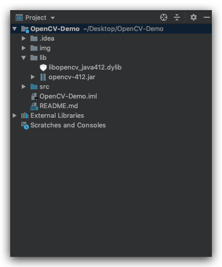

## Group Project Configuration Demo
- MacOS
- Intellij
- [Homebrew](https://brew.sh/)
- X-code CLI
- [OpenCV 4.1.2](https://opencv.org/releases/)

### Stage: Build OpenCV
- Install `X-code Command Line`
```sh
xcode-select --install
```
- Install Apache `Ant`
```sh
# you may need to remove .DS_Store
brew install ant 
```
- Config `HomeBrew`
```sh
export HOMEBREW_EDITOR=code # for vscode
export HOMEBREW_EDITOR=nano # for nano
export HOMEBREW_EDITOR=sublime # for sublime
export HOMEBREW_EDITOR=atom # for atom
export HOMEBREW_EDITOR="open -t" # for TextEdit
brew edit opencv
```
- Modify `opencv.rb`
<!-- https://github.com/opencv/opencv/archive/4.0.1.tar.gz -->
```ruby
# line 1
url "https://github.com/opencv/opencv/archive/4.1.2.tar.gz"
# line 2
-DBUILD_opencv_java=ON
```


- Install and build `opencv`
```sh
# patience from 20 - 40 minutes
brew install --build-from-source opencv
```
- Copy Built File into Project
```sh
open /usr/local/Cellar/opencv/4.1.2/share/java/opencv4
```



-Djava.library.path=/opencv/build/lib